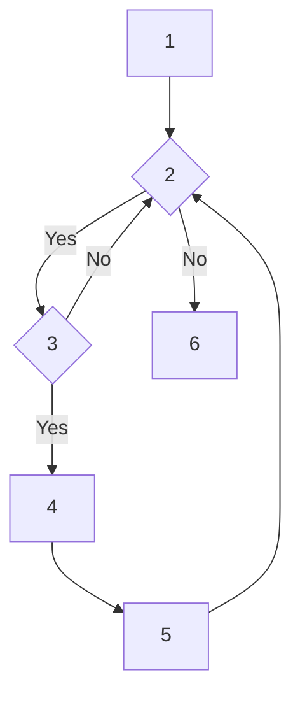

+++
title = "[2025년 1회] 정보처리기사 실기 복원 문제"
date = 2025-01-20T00:00:00+09:00
draft = false
description = "2025년 1회 정보처리기사 실기 시험의 복원 문제와 답안입니다."
tags = ["정보처리기사", "실기", "복원문제", "자격증"]
categories = ["자격증"]
+++

# **[2025년 1회] 정보처리기사 실기 복원 문제**

## **1. 다음은 네트워크 보완에 관련된 문제이다. 괄호안에 알맞는 용어를 작성하시오.**

(   )은/는 '세션을 가로채다.' 라는 의미로 다른 사람의 세션 상태를 훔치거나 도용하여 액세스하는 해킹 기법이다.

TCP (   )은/는 TCP의 3-way 핸드셰이크가 완료된 후에 공격자가 시퀀스 번호 등을 조작하여 정상적인 세션을 가로채고 인증 없이 통신을 탈취하는 공격 공격이다.

<details>
<summary>답안 보기</summary>

**답: 세션 하이재킹**

**해설:**
- **세션 하이재킹(Session Hijacking)**은 공격자가 정상적인 사용자의 세션을 탈취하여 해당 사용자의 권한으로 시스템에 접근하는 공격 기법입니다.
- TCP 세션 하이재킹은 TCP의 3-way 핸드셰이크 과정에서 시퀀스 번호를 예측하거나 조작하여 정상적인 통신 세션을 가로채는 방식입니다.
- 공격자는 시퀀스 번호를 알아내면 해당 세션에 끼어들어 정상 사용자로 위장할 수 있습니다.
- 방어 방법으로는 세션 토큰 암호화, 세션 타임아웃 설정, HTTPS 사용 등이 있습니다.

</details>

## **2. 다음은 제약조건과 관련된 문제이다. 괄호안에 알맞는 용어를 보기에 골라 작성하시오.**

| 구분                                                   | (ㄱ) 무결성 제약조건                   | (ㄴ) 무결성 제약조건                   | (ㄷ) 무결성 제약조건                   |
| ------------------------------------------------------ | -------------------------------------- | -------------------------------------- | -------------------------------------- |
| 제약 대상                                              | 속성                                   | 튜플                                   | 속성과 튜플                            |
| NULL 값                                                | -                                      | 기본키                                 | 외래키                                 |
| 릴레이션 내 제약조건의 개수                            | 속성의 개수와 동일                     | 1개                                    | 0~여러 개                              |
| 기타                                                   | - 튜플 삽입/수정 시 제약사항 우선 확인 | - 튜플 삽입/수정 시 제약사항 우선 확인 | - 튜플 삽입/수정 시 제약사항 우선 확인 |
| - 부모 릴레이션의 투플 수정/삭제 시 제약사항 우선 확인 |

**[보기]**

개체, 참조, 도메인

<details>
<summary>답안 보기</summary>

**답:**
- ㄱ. 도메인
- ㄴ. 개체
- ㄷ. 참조

**해설:**
- **도메인 무결성 제약조건**: 속성(컬럼)에 대한 제약조건으로, 각 속성의 개수만큼 존재합니다. NULL 값 허용 여부, 데이터 타입, 범위 등을 제한합니다.
- **개체 무결성 제약조건**: 튜플(행)에 대한 제약조건으로, 기본키는 NULL이 될 수 없고 중복될 수 없습니다. 릴레이션당 1개만 존재합니다.
- **참조 무결성 제약조건**: 속성과 튜플 모두에 대한 제약조건으로, 외래키는 참조하는 기본키의 값이거나 NULL이어야 합니다. 0개 이상 존재할 수 있습니다.

</details>

## **3. 아래의 내용에서 설명 글의 괄호안의 용어를 영문 약자로 작성하시오.**

(        ) 은/는 3글자의 영어 약자로 이루어진 오류 기법으로 데이터를 전송하거나 저장할 때 데이터의 오류를 감지하는 데 사용되는 오류 검출 코드이다.

(        ) 은/는 데이터에 체크섬을 추가하여 데이터를 전송하거나 저장한 후, 수신 또는 읽을 때 이 체크섬을 다시 계산하여 데이터가 변경되었는지 확인하는 기법이다.

(        ) 은/는 데이터 전송의 안정성을 높이는 데 중요한 역할을 한다.

데이터는 이진수(0과 1)로 표현되며 정해진 다항식(x³ + x + 1)을 기반으로 데이터를 2진수 나눗셈하고나머지를 (       ) 값으로 삼는다.

<details>
<summary>답안 보기</summary>

**답: CRC**

**해설:**
- **CRC(Cyclic Redundancy Check)**는 순환 중복 검사로, 데이터 전송 시 오류를 감지하는 오류 검출 코드입니다.
- 3글자 영어 약자로 구성되어 있으며, 데이터에 체크섬을 추가하여 전송 후 수신측에서 다시 계산하여 데이터 무결성을 확인합니다.
- 다항식 기반의 나눗셈 연산을 사용하여 나머지를 체크섬으로 사용합니다.
- 네트워크 통신, 저장장치 등에서 데이터 전송의 안정성을 높이는 데 중요한 역할을 합니다.
- 예시 다항식 x³ + x + 1은 CRC-3에 해당하는 다항식입니다.

</details>

## **4. 다음은 악성코드 관련된 문제이다. 아래 내용을 확인하여 보기에 골라 작성하시오.**

사용자가 원치 않는 소프트웨어를 구매하도록 조작하기 위해 사회 공학을 사용하여 충격, 불안 또는 위협에 대한 인식을 유발하는 악성 소프트웨어의 한 형태이다.

'겁을 주다'라는 영어 단어에서 유래한 것으로 공포를 이용하여 피해자를 속여 대가를 지불 하거나 특정 행동을 유도하는 랜섬웨어이다.

가짜 바이러스 경고나 시스템 문제를 표시하여 사용자가 돈을 지불하거나 특정 소프트웨어를 설치하도록 속이는 방식으로 작동한다.

**보기**

ㄱ. 컴포넌트 웨어  ㄴ. 유즈웨어  ㄷ. 셔블웨어  ㄹ. 스캐어 웨어  ㅁ. 안티 스파이 웨어  ㅂ. 네트웨어  ㅅ. 그룹웨어  ㅇ. 애드웨어

<details>
<summary>답안 보기</summary>

**답: ㄹ (스캐어웨어)**

**해설:**
- **스캐어웨어(Scareware)**는 '겁을 주다(scare)'라는 의미에서 유래한 악성 소프트웨어입니다.
- 가짜 바이러스 경고나 시스템 문제를 표시하여 사용자를 공포에 빠뜨리고, 돈을 지불하거나 특정 소프트웨어를 설치하도록 유도합니다.
- 사회공학적 기법을 사용하여 충격, 불안, 위협감을 조성하는 것이 특징입니다.
- 랜섬웨어와 유사하지만, 실제로 파일을 암호화하지 않고 공포심만을 이용합니다.
- 방어 방법으로는 신뢰할 수 있는 백신 프로그램 사용, 의심스러운 팝업 무시, 시스템 업데이트 유지 등이 있습니다.

</details>

## **5. 다음은 Java 코드에 대한 문제이다. 아래 코드를 확인하여 알맞는 출력값을 작성하시오.**

```jsx
public class Main {

  public static void main(String[] args) {

    int a=5,b=0;

    try{
      System.out.print(a/b);
    }catch(ArithmeticException e){
      System.out.print("출력1");
    }catch(ArrayIndexOutOfBoundsException e) {
      System.out.print("출력2");
    }catch(NumberFormatException e) {
      System.out.print("출력3");
    }catch(Exception e){
      System.out.print("출력4");
    }finally{
      System.out.print("출력5");
    }
  }
}

```

<details>
<summary>답안 보기</summary>

**답: 출력1출력5**

**해설:**
- `a=5, b=0`으로 설정되어 있어 `a/b`는 5÷0이 되어 **ArithmeticException**이 발생합니다.
- Java의 예외 처리 순서에 따라 가장 구체적인 예외부터 처리하므로, `ArithmeticException`이 첫 번째 catch 블록에서 처리됩니다.
- 따라서 "출력1"이 출력됩니다.
- `finally` 블록은 예외 발생 여부와 관계없이 항상 실행되므로 "출력5"가 출력됩니다.
- 결과적으로 "출력1출력5"가 연속으로 출력됩니다.

</details>

## **6. 아래 내용은 ARP/RARP에 대한 설명이다. 각 설명에 해당하는 것을 작성하시오.**

( 1 ) 은/는 네트워크상에서 IP 주소를 MAC 주소로 변환하는 프로토콜이고,

( 2 ) 은/는 MAC 주소를 IP 주소로 변환하는 프로토콜이다.

<details>
<summary>답안 보기</summary>

**답:**
- (1) ARP
- (2) RARP

**해설:**
- **ARP(Address Resolution Protocol)**: IP 주소를 MAC 주소로 변환하는 프로토콜입니다. 네트워크에서 실제 통신을 위해 필요한 물리적 주소를 알아내는 데 사용됩니다.
- **RARP(Reverse Address Resolution Protocol)**: MAC 주소를 IP 주소로 변환하는 프로토콜입니다. 디스크 없는 워크스테이션이나 임베디드 시스템에서 자신의 IP 주소를 알아내는 데 사용됩니다.
- ARP는 브로드캐스트로 요청을 보내고, 해당 IP를 가진 호스트가 자신의 MAC 주소를 응답하는 방식으로 동작합니다.
- RARP는 DHCP의 전신으로, 현재는 DHCP가 더 많이 사용됩니다.

</details>

## **7. 다음은 SQL 문제이다. 아래 두 테이블을 참고하여 보기에 쿼리 실행 결과를 작성하시오.**

### [emp 테이블]

### [sal 테이블]

| id   | name   |
| ---- | ------ |
| 1001 | 김철수 |
| 1002 | 홍길동 |
| 1004 | 강감찬 |
| 1008 | 이순신 |

| id   | incentives |
| ---- | ---------- |
| 1002 | 300        |
| 1004 | 300        |
| 1008 | 1000       |
| 1009 | 500        |

**[보기]**

SELECT name, incentive FROM emp, sal WHERE emp.id = sal.id and incentives >= 500

<details>
<summary>답안 보기</summary>

**답:**

| name   | incentives |
| ------ | ---------- |
| 이순신 | 1000       |

**해설:**
- 두 테이블을 INNER JOIN하여 `emp.id = sal.id` 조건으로 연결합니다.
- `incentives >= 500` 조건을 만족하는 레코드만 선택합니다.
- emp 테이블에서 id가 1008인 이순신과 sal 테이블에서 id가 1008인 레코드(1000)가 매칭됩니다.
- 다른 id들은 incentives가 500 미만이므로 조건을 만족하지 않습니다.
- 결과적으로 이순신의 1000 incentives만 출력됩니다.

</details>

## **8. 아래는 데이터베이스에 관련된 설명이다. 알맞는 용어를 보기에서 골라 괄호를 작성하시오.**

1. 릴레이션에서 속성의 개수를 의미 : (  1  )

2. 릴레이션에서 튜플의 개수를 의미 : (  2  )

3. 한 릴레이션의 속상이 다른 릴레이션의 기본 키를 참조할 때, 참조하는 속성을 의미 : (  3  )

4. 특정 속성에 대해 입력될 수 있는 값의 유형이나 범위를 의미하고 무결성을 보장하는 기준 : (  4  )

**[보기]**

ㄱ. domain   ㄴ. primary   ㄷ. degree   ㄹ. candidate   ㅁ. cardinality   ㅂ. attribute   ㅅ. foreign

<details>
<summary>답안 보기</summary>

**답:**
- (1) ㄷ (degree)
- (2) ㅁ (cardinality)
- (3) ㅅ (foreign)
- (4) ㄱ (domain)

**해설:**
- **Degree(차수)**: 릴레이션에서 속성(컬럼)의 개수를 의미합니다. 예를 들어 학생 테이블에 학번, 이름, 학과가 있다면 degree는 3입니다.
- **Cardinality(기수)**: 릴레이션에서 튜플(행)의 개수를 의미합니다. 즉, 테이블에 저장된 레코드의 수입니다.
- **Foreign Key(외래키)**: 다른 릴레이션의 기본키를 참조하는 속성입니다. 참조 무결성을 보장하는 역할을 합니다.
- **Domain(도메인)**: 특정 속성에 대해 입력될 수 있는 값의 유형이나 범위를 의미합니다. 예를 들어 나이는 0~150 범위의 정수 등입니다.

</details>

## **9. IP 주소가 192.168.35.10, 서브넷 255.255.252.0인 PC에서 브로드캐스팅으로 다른 IP로 정보를 전달한다고 할 때 수신할 수 있는 알맞는 IP를 보기에서 골라 모두 작성하시오.**

**[보기]**

ㄱ. 192.168.34.1

ㄴ. 192.168.32.19

ㄷ. 192.168.35.200

ㄹ. 192.168.33.138

ㅁ. 192.168.35.50

<details>
<summary>답안 보기</summary>

**답: ㄱ, ㄴ, ㄷ, ㄹ, ㅁ (모든 IP)**

**해설:**
- 서브넷 마스크 255.255.252.0을 이진수로 변환하면 11111111.11111111.11111100.00000000입니다.
- 네트워크 ID는 IP 주소와 서브넷 마스크를 AND 연산한 결과입니다.
- 192.168.35.10 AND 255.255.252.0 = 192.168.32.0
- 따라서 네트워크 주소는 192.168.32.0이고, 호스트 주소 범위는 192.168.32.1 ~ 192.168.35.254입니다.
- 모든 보기 IP들이 이 범위에 포함되므로 모두 같은 네트워크에 속하여 브로드캐스트로 통신 가능합니다.

</details>

## **10. 다음은 C언어에 대한 문제이다. 아래 코드를 확인하여 알맞는 출력값을 작성하시오.**

```jsx
#include <stdio.h>
char Data[5] = {'B', 'A', 'D', 'E'};
char c;

int main(){
    int i, temp, temp2;

    c = 'C';
    printf("%d\n", Data[3]-Data[1]);

    for(i=0;i<5;++i){
        if(Data[i]>c)
            break;
    }

    temp = Data[i];
    Data[i] = c;
    i++;

    for(;i<5;++i){
        temp2 = Data[i];
        Data[i] = temp;
        temp = temp2;
    }

    for(i=0;i<5;i++){
        printf("%c", Data[i]);
    }
}

```

<details>
<summary>답안 보기</summary>

**답:**
- 첫 번째 출력: 4
- 두 번째 출력: BACDE

**해설:**
- `Data[3] - Data[1]` = 'E' - 'A' = 69 - 65 = 4 (ASCII 값 차이)
- `c = 'C'`로 설정하고, 배열에 'C'를 삽입하는 과정:
  1. Data 배열: ['B', 'A', 'D', 'E', '\0']
  2. 'C'를 적절한 위치에 삽입하기 위해 'D'보다 작은 첫 번째 위치를 찾음
  3. 'C'를 'D' 위치에 삽입하고, 나머지 요소들을 한 칸씩 뒤로 이동
  4. 최종 배열: ['B', 'A', 'C', 'D', 'E']
- 따라서 "BACDE"가 출력됩니다.

</details>

## **11. 다음은 C언어에 대한 문제이다. 아래 코드를 확인하여 알맞는 출력값을 작성하시오.**

```jsx
#include <stdio.h>
#include <stdlib.h>

void set(int** arr, int* data, int rows, int cols) {
    for (int i = 0; i < rows * cols; ++i) {
        arr[((i + 1) / rows) % rows][(i + 1) % cols] = data[i];
    }
}

int main() {
    int rows = 3, cols = 3, sum = 0;
    int data[] = {5, 2, 7, 4, 1, 8, 3, 6, 9};
    int** arr;
    arr = (int**) malloc(sizeof(int*) * rows);
    for (int i = 0; i < cols; i++) {
        arr[i] = (int*) malloc(sizeof(int) * cols);
    }

    set(arr, data, rows, cols);

    for (int i = 0; i < rows * cols; i++) {
        sum += arr[i / rows][i % cols] * (i % 2 == 0 ? 1 : -1);
    }

    for(int i=0; i<rows; i++) {
        free(arr[i]);
    }
    free(arr);

    printf("%d", sum);
}

```

<details>
<summary>답안 보기</summary>

**답: 13**

**해설:**
- `set` 함수는 2차원 배열에 데이터를 특정 패턴으로 채우는 함수입니다.
- `((i + 1) / rows) % rows`와 `(i + 1) % cols`로 인덱스를 계산하여 배열을 채웁니다.
- 최종적으로 배열은 다음과 같이 채워집니다:
  ```
  [0, 2, 7]
  [4, 1, 8]
  [3, 6, 9]
  ```
- `sum` 계산에서 `i % 2 == 0 ? 1 : -1`은 짝수 인덱스는 양수, 홀수 인덱스는 음수로 계산합니다.
- 따라서: 0×1 + 2×(-1) + 7×1 + 4×(-1) + 1×1 + 8×(-1) + 3×1 + 6×(-1) + 9×1 = 13

</details>

## **12. 다음은 결합도와 관련된 내용이다. 보기에 알맞는 답을 골라 작성하시오.**

(1) 다른 모듈 내부에 있는 변수나 기능을 다른 모듈에서 사용하는 경우의 결합도

(2) 모듈 간의 인터페이스로 배열이나 오브젝트, 자료구조 등이 전달되는 경우의 결합도

(3) 파라미터가 아닌 모듈 밖에 선언되어 있는 전역 변수를 참조하고 전역 변수를 갱신하는 식으로 상호작용하는 경우의 결합도

**[보기]**

ㄱ. 자료 결합도  ㄴ. 스탬프 결합도 ㄷ. 제어 결합도  ㄹ. 공통 결합도  ㅁ. 내용 결합도  ㅂ. 외부 결합도

<details>
<summary>답안 보기</summary>

**답:**
- (1) ㅁ (내용 결합도)
- (2) ㄴ (스탬프 결합도)
- (3) ㄹ (공통 결합도)

**해설:**
- **내용 결합도**: 다른 모듈의 내부 변수나 기능을 직접 사용하는 가장 강한 결합도입니다. 모듈 간의 독립성이 크게 저하됩니다.
- **스탬프 결합도**: 배열, 객체, 구조체 등의 복합 자료구조를 모듈 간에 전달하는 결합도입니다. 자료 결합도보다는 강하지만 제어 결합도보다는 약합니다.
- **공통 결합도**: 전역 변수를 통해 모듈들이 상호작용하는 결합도입니다. 여러 모듈이 같은 전역 변수를 공유하므로 한 모듈의 변경이 다른 모듈에 영향을 줄 수 있습니다.

</details>

## **13. 다음은 Java 코드에 대한 문제이다. 아래 코드를 확인하여 알맞는 출력값을 작성하시오.**

```jsx
public class Main {
    public static void main(String[] args) {
        new Child();
        System.out.println(Parent.total);
    }
}


class Parent {
    static int total = 0;
    int v = 1;

    public Parent() {
        total += (++v);
        show();
    }

    public void show() {
        total += total;
    }
}


class Child extends Parent {
    int v = 10;

    public Child() {
        v += 2;
        total += v++;
        show();
    }

    @Override
    public void show() {
        total += total * 2;
    }
}
```

<details>
<summary>답안 보기</summary>

**답: 54**

**해설:**
- `new Child()`가 실행되면 Child 생성자가 호출됩니다.
- Child 생성자는 먼저 부모 클래스 Parent의 생성자를 호출합니다.
- Parent 생성자에서: `total += (++v)` = `total += 2` (v는 1에서 2로 증가)
- Parent의 `show()` 호출: `total += total` = `total = 2 + 2 = 4`
- Child 생성자에서: `v += 2` = 12, `total += v++` = `total += 12` (후위 증가)
- Child의 `show()` 호출: `total += total * 2` = `total = 16 + 32 = 48`
- `v++` 실행: `total += 6` = `total = 48 + 6 = 54`

</details>

## **14. 아래는 디자인 패턴에 대한 설명이다. 알맞는 답을 보기에 골라 작성하시오.**

서로 다른 인터페이스를 가진 클래스들을 연결해 사용 가능하게 한다.

기존 클래스(Adaptee)를 원하는 인터페이스(Target)에 맞게 변환하는 어댑터(Adapter)를 만든다.

기존 클래스를 감싸서(wrapper) 인터페이스를 변환해주는 역할을 한다.

| 생성 (Creational) | 구조 (Structural) | 행위 (Behavioral) |
| ----------------- | ----------------- | ----------------- |
| Singleton         | Adapter           | Strategy          |
| Factory Method    | Bridge            | Template Method   |
| Abstract Factory  | Composite         | Observer          |
| Builder           | Decorator         | State             |
| Prototype         | Façade            | Command           |

<details>
<summary>답안 보기</summary>

**답: Adapter**

**해설:**
- **어댑터 패턴(Adapter Pattern)**은 서로 다른 인터페이스를 가진 클래스들을 연결해 사용 가능하게 하는 구조 패턴입니다.
- 기존 클래스(Adaptee)를 원하는 인터페이스(Target)에 맞게 변환하는 어댑터(Adapter)를 만듭니다.
- 기존 클래스를 감싸서(wrapper) 인터페이스를 변환해주는 역할을 합니다.
- 예시: 110V 전자제품을 220V 콘센트에 연결하기 위한 어댑터와 같은 개념입니다.
- 코드에서 자주 사용되는 예로는 레거시 시스템과 새로운 시스템 간의 인터페이스 호환성을 제공할 때 사용됩니다.

</details>

## **15. 문장(Statement) 커버리지 테스트를 수행하려고 한다. 코드를 아래의 제어 흐름도 빈칸에 연결되도록 작성하고 문장 커버리지 순서대로 작성하시오.**

```jsx
int Main(int b[], int m, int x) {
    int a = 0;
    while (a < m || b[a] < x) {
        if (b[a] < 0)
            b[a] = -b[a];
        a++;
    }
    return 1;
}
```

**[흐름도]**



1. (  ①  ) 2. (  ②  ) 3. (  ③  ) 4. (  ④  ) 5. (  ⑤  ) 6. (  ⑥  )

문장 커버리지 순서 1 → 2  → (          ⑦           )

<details>
<summary>답안 보기</summary>

**답:**
- (1) int a = 0
- (2) a < m || b[a] < x
- (3) b[a] < 0
- (4) b[a] = -b[a];
- (5) a++;
- (6) return 1;
- (7) ③ → ④ → ⑤ → ② → ⑥

**해설:**
- **문장 커버리지**는 프로그램의 모든 문장이 최소 한 번씩 실행되는지 확인하는 테스트 기법입니다.
- 제어 흐름도에서 각 노드는 코드의 문장을 나타냅니다.
- 문장 커버리지 순서는 모든 문장을 최소 한 번씩 실행하는 경로를 의미합니다.
- ③ → ④ → ⑤ → ② → ⑥ 순서로 실행하면 모든 문장이 한 번씩 실행됩니다.
- 이는 while 루프를 한 번만 실행하고 조건이 false가 되어 종료되는 경우입니다.

</details>

## **16. 다음은 Java 코드에 대한 문제이다. 아래 코드를 확인하여 알맞는 출력값을 작성하시오.**

```jsx
public class Main {

    public static void main(String[] args) {
        int[] data = {3, 5, 8, 12, 17};
        System.out.println(func(data, 0, data.length - 1));
    }

    static int func(int[] a, int st, int end) {
        if (st >= end) return 0;
        int mid = (st + end) / 2;
        return a[mid] + Math.max(func(a, st, mid), func(a, mid + 1, end));
    }

}
```

<details>
<summary>답안 보기</summary>

**답: 20**

**해설:**
- `func` 함수는 분할 정복(Divide and Conquer) 방식으로 동작하는 재귀 함수입니다.
- 배열의 중간값(`a[mid]`)을 선택하고, 좌우 부분 배열 중 더 큰 값을 반환하는 함수입니다.
- 실행 과정:
  1. `func([3,5,8,12,17], 0, 4)`: mid=2, a[2]=8
  2. `Math.max(func([3,5], 0, 1), func([12,17], 3, 4))`
  3. `func([3,5], 0, 1)`: mid=0, a[0]=3
  4. `func([12,17], 3, 4)`: mid=3, a[3]=12
  5. 최종 결과: 8 + 12 = 20

</details>

## **17. 다음은 파이썬에 대한 문제이다. 아래 코드를 확인하여 알맞는 출력값을 작성하시오.**

```jsx
class Node:
    def __init__(self, value):
        self.value = value
        self.children = []

def tree(li):
    nodes = [Node(i) for i in li]
    for i in range(1, len(li)):
        nodes[(i - 1) // 2].children.append(nodes[i])
    return nodes[0]

def calc(node, level=0):
    if node is None:
        return 0
    return (node.value if level % 2 == 1 else 0) + sum(calc(n, level + 1) for n in node.children)

li = [3, 5, 8, 12, 15, 18, 21]

root = tree(li)

print(calc(root))

```

<details>
<summary>답안 보기</summary>

**답: 13**

**해설:**
- `tree` 함수는 배열을 이진 트리로 변환합니다. `(i-1)//2` 공식으로 부모 노드를 찾아 연결합니다.
- 트리 구조:
  ```
      3
     / \
    5   8
   / \ / \
  12 15 18 21
  ```
- `calc` 함수는 홀수 레벨(level % 2 == 1)의 노드 값만 합산합니다.
- 레벨 1: 5 + 8 = 13
- 레벨 3: 12 + 15 + 18 + 21 = 66
- 하지만 홀수 레벨만 계산하므로 5 + 8 = 13이 결과입니다.

</details>

**18. 다음은 C언어에 대한 문제이다. 아래 코드를 확인하여 알맞는 출력값을 작성하시오.**

```jsx
#include <stdio.h>
#include <stdlib.h>

typedef struct Data {
    int value;
    struct Data *next;
} Data;

Data* insert(Data* head, int value) {
    Data* new_node = (Data*)malloc(sizeof(Data));
    new_node->value = value;
    new_node->next = head;
    return new_node;
}

Data* reconnect(Data* head, int value) {
    if (head == NULL || head->value == value) return head;
    Data *prev = NULL, *curr = head;
    while (curr != NULL && curr->value != value) {
        prev = curr;
        curr = curr->next;
    }

    if (curr != NULL && prev != NULL) {
        prev->next = curr->next;
        curr->next = head;
        head = curr;
    }
    return head;
}

int main() {

    Data *head = NULL, *curr;
    for (int i = 1; i <= 5; i++)
        head = insert(head, i);
    head = reconnect(head, 3);
    for (curr = head; curr != NULL; curr = curr->next)
        printf("%d", curr->value);
    return 0;
}
```

<details>
<summary>답안 보기</summary>

**답: 35421**

**해설:**
- `insert` 함수는 연결 리스트의 맨 앞에 새 노드를 삽입합니다.
- 초기 리스트: 5 → 4 → 3 → 2 → 1 (역순으로 삽입됨)
- `reconnect` 함수는 특정 값을 가진 노드를 찾아서 리스트의 맨 앞으로 이동시킵니다.
- 값 3을 찾아서 맨 앞으로 이동: 3 → 5 → 4 → 2 → 1
- 따라서 출력 결과는 35421입니다.

</details>

## **19.다음은 C언어에 대한 문제이다. 아래 코드를 확인하여 알맞는 출력값을 작성하시오.**

```jsx
#include <stdio.h>

typedef struct student {
    char* name;
    int score[3];
} Student;

int dec(int enc) {
    return enc & 0xA5;
}

int sum(Student* p) {
    return dec(p->score[0]) + dec(p->score[1]) + dec(p->score[2]);
}

int main() {
    Student s[2] = { "Kim", {0xA0, 0xA5, 0xDB}, "Lee", {0xA0, 0xED, 0x81} };
    Student* p = s;
    int result = 0;

    for (int i = 0; i < 2; i++) {
        result += sum(&s[i]);
    }
    printf("%d", result);
    return 0;
}
```

<details>
<summary>답안 보기</summary>

**답: 908**

**해설:**
- `dec` 함수는 비트 AND 연산(`&`)을 사용하여 0xA5와 AND 연산을 수행합니다.
- 0xA5 = 10100101(2진수)
- 각 학생의 점수 계산:
  - Kim: 0xA0 & 0xA5 = 160 & 165 = 160
  - 0xA5 & 0xA5 = 165 & 165 = 165
  - 0xDB & 0xA5 = 219 & 165 = 145
  - Kim 총합: 160 + 165 + 145 = 470
- Lee: 0xA0 & 0xA5 = 160 & 165 = 160
  - 0xED & 0xA5 = 237 & 165 = 165
  - 0x81 & 0xA5 = 129 & 165 = 129
  - Lee 총합: 160 + 165 + 129 = 454
- 최종 결과: 470 + 454 = 924

</details>

## **20. 다음은 Java 코드에 대한 문제이다. 아래 코드를 확인하여 알맞는 출력값을 작성하시오.**

```jsx
public class Main {
  public static void main(String[] args) {
    System.out.println(calc("5"));
  }

  static int calc(int value) {
    if (value <= 1) return value;
    return calc(value - 1) + calc(value - 2);
  }

  static int calc(String str) {
    int value = Integer.valueOf(str);
    if (value <= 1) return value;
    return calc(value - 1) + calc(value - 3);
  }
}
```

<details>
<summary>답안 보기</summary>

**답: 4**

**해설:**
- `calc("5")`가 호출되면 String 타입의 오버로딩된 `calc` 함수가 실행됩니다.
- `calc(String str)` 함수는 `calc(value - 1) + calc(value - 3)`를 호출합니다.
- 재귀 호출 과정:
  1. `calc(5)`: `calc(4) + calc(2)`
  2. `calc(4)`: `calc(3) + calc(1)`
  3. `calc(3)`: `calc(2) + calc(0)`
  4. `calc(2)`: `calc(1) + calc(-1)`
  5. `calc(1)`: 1 (기저 조건)
  6. `calc(0)`: 0 (기저 조건)
  7. `calc(-1)`: -1 (기저 조건)
- 최종 계산: 1 + 0 + 1 + (-1) + 1 = 2 + 2 = 4

</details>